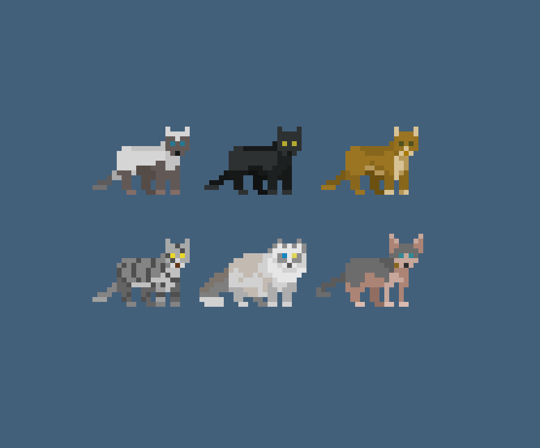

# Buddy

A pixel-art cat that lives on your desktop. Pet it, drag it around, throw it across the screen — and use it as a pomodoro timer, todo list, and habit tracker while it's at it.



## What it does

- Sits on your screen, wanders around, reacts when you click or drag it
- Click it to open a panel with a pomodoro timer, todos, habits, and stats
- Earn coins for finishing tasks and habits, lose hearts for missing them
- 6 skins to pick from
- Starts automatically at login (toggle off in Settings if you don't want it)
- Right-click for the menu, including quit

## Install

Download the latest release for your OS from the [Releases](../../releases) page:

- **Windows** — run the installer
- **macOS** — open the `.dmg`, drag to Applications
- **Linux** — install the `.deb`, or run the `.AppImage` directly

## Running from source

```bash
pip install -r requirements.txt
python3 main.py
```

Linux also needs `libxcb-cursor0` (`sudo apt install libxcb-cursor0`, or `xcb-util-cursor` on Fedora/Arch) — a system package, not something pip installs.

`./start_buddy.sh` runs it in the background instead of tying up your terminal.

## Building it yourself

```bash
pip install pyinstaller
pyinstaller buddy.spec
```

`.github/workflows/build.yml` builds installers for all three platforms automatically on GitHub's runners whenever a `v*` tag is pushed.

## Credits

Cat sprites: Pet Cats Pack (CC0) — see `resources/skins/License.txt`.
